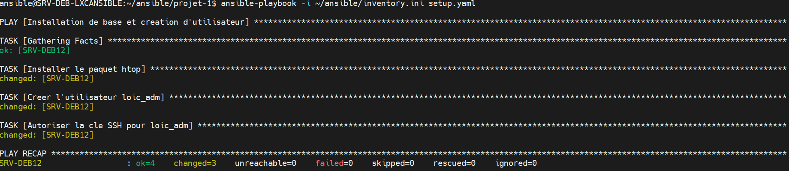
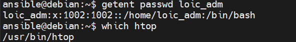
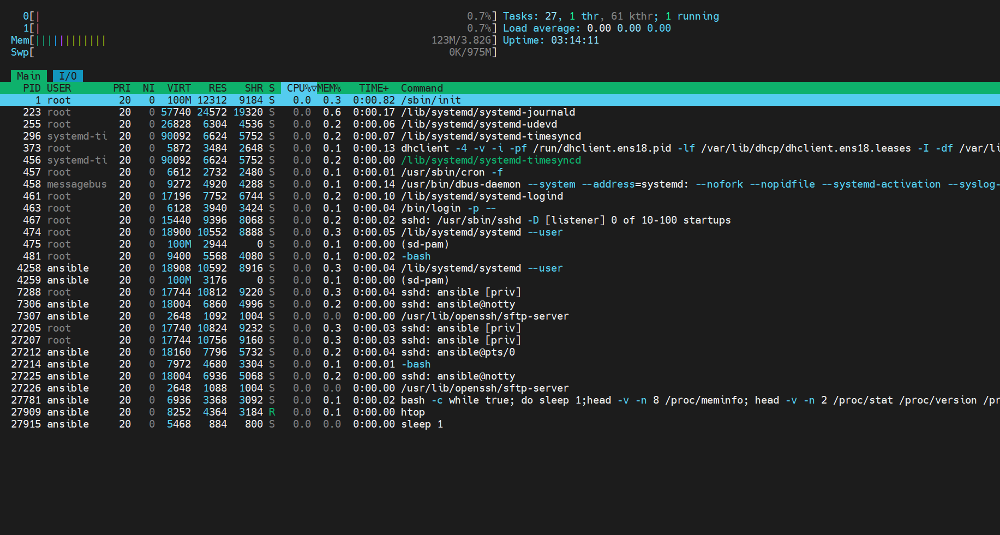
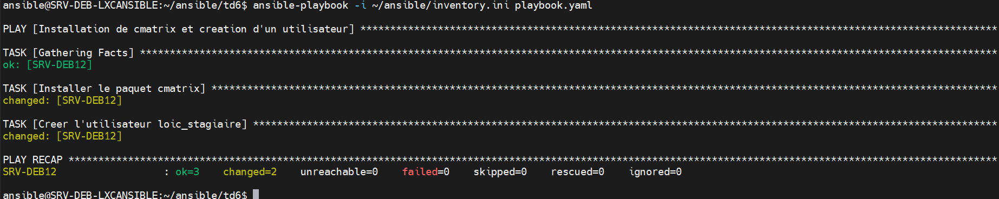
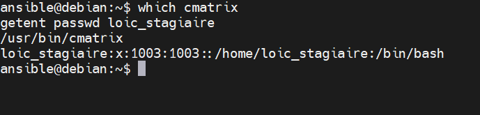
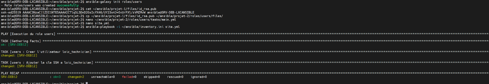
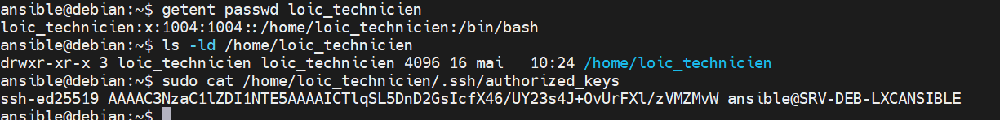

# 🚀 Déploiement d’un environnement Ansible sur un conteneur LXC Debian 12

## 🌐 Tableau de l’infrastructure utilisée

| Nom de machine        | Adresse IP       | Rôle / Utilisation                          |
|-----------------------|------------------|---------------------------------------------|
| SRV-DEB-LXCANSIBLE    | 10.108.0.150     | Machine de contrôle Ansible (LXC)           |
| SRV-DEB12             | 10.108.0.151     | Machine cible Debian 12 (VM)                |

## 🧾 Objectif
Ce guide décrit étape par étape l'installation et la configuration d'Ansible sur un conteneur LXC Debian 12,
ainsi que la configuration d'une machine Debian distante (VM) pour être gérée via Ansible. Chaque commande est accompagnée d'explications détaillées.

---

# 🖥️ 0. Création de la machine cible Debian 12 (VM)

### 🎯 Objectif :
Préparer une machine distante que le LXC Ansible pourra gérer via SSH.

### ⚙️ Étapes :
**À faire depuis Proxmox :**
- Créer une VM Debian 12 avec IP statique `10.108.0.151`
- Activer SSH
- Créer un utilisateur `ansible`

### 🔧 Commandes à exécuter (sur la VM, connecté en root) :
```bash
adduser ansible
usermod -aG sudo ansible
apt install -y sudo
echo 'ansible ALL=(ALL) NOPASSWD:ALL' > /etc/sudoers.d/ansible
chmod 440 /etc/sudoers.d/ansible
```

---

# 🧱 1. Création du conteneur LXC Debian 12 (Machine de contrôle Ansible)

### 🎯 Objectif :
Créer le poste de contrôle qui exécutera les commandes Ansible.

**À faire sur Proxmox :**
- Créer un LXC Debian 12 avec IP statique `10.108.0.150`
- Accès SSH root
- Nom : `SRV-DEB-LXCANSIBLE`

---

# 🛠️ 2. Préparation du LXC Ansible

### 🔧 Étapes à réaliser connecté en root :

```bash
apt update
apt install -y openssh-server sudo
adduser ansible
usermod -aG sudo ansible
echo 'ansible ALL=(ALL) NOPASSWD:ALL' > /etc/sudoers.d/ansible
chmod 440 /etc/sudoers.d/ansible
```

---

# 🔐 3. Génération et déploiement de la clé SSH

### 🎯 Objectif :
Permettre à la machine de contrôle d’accéder à la machine cible sans mot de passe.

### 🧑‍💻 Sur le LXC, connecté en tant qu’utilisateur `ansible` :

```bash
ssh-keygen -t ed25519
ssh-copy-id ansible@10.108.0.151
```

---

## 📁 4. Création du fichier d’inventaire Ansible

```bash
mkdir -p ~/ansible
cd ~/ansible
nano inventory.ini
```

### 📝 Contenu du fichier `inventory.ini` :
```ini
[local]
localhost ansible_connection=local

[debian]
SRV-DEB12 ansible_host=10.108.0.151 ansible_user=ansible
```

---

## 🧪 5. Test de connectivité avec le module `ping`

```bash
ansible all -i ~/ansible/inventory.ini -m ping
```

Résultat attendu :
```json
localhost | SUCCESS => { "ping": "pong" }
SRV-DEB12 | SUCCESS => { "ping": "pong" }
```

---

# 📦 Créer et lancer un premier playbook Ansible

### 📁 Structure

```bash
mkdir -p ~/ansible/projet-1/files
cd ~/ansible/projet-1
```

### ✍️ Contenu du fichier `setup.yaml`

```yaml
- name: Installation de base et creation d'utilisateur
  hosts: SRV-DEB12
  remote_user: ansible
  become: yes
  become_method: sudo

  tasks:
    - name: Installer le paquet htop
      ansible.builtin.apt:
        name: htop
        state: present

    - name: Creer l'utilisateur loic_adm
      ansible.builtin.user:
        name: loic_adm
        shell: /bin/bash
        create_home: yes

    - name: Autoriser la cle SSH pour loic_adm
      ansible.posix.authorized_key:
        user: loic_adm
        state: present
        manage_dir: yes
        key: "{{ lookup('file', 'files/id_rsa.pub') }}"
```

### 🔐 Clé SSH publique à placer dans :

```bash
~/ansible/projet-1/files/id_rsa.pub
```

Utiliser :
```bash
cat ~/.ssh/id_ed25519.pub > ~/ansible/projet-1/files/id_rsa.pub
```

### ▶️ Exécution du playbook :

```bash
ansible-playbook -i ~/ansible/inventory.ini setup.yaml
```

---

## 📸 Captures de vérification 

### ✅ Résultat de l'exécution du playbook
<p align="center">
  
</p>

---

### 👤 Vérification de l'utilisateur `loic_adm` et du paquet `htop`
<p align="center">
  
</p>

---

### 📊 Affichage de `htop` en temps réel
<p align="center">
  
</p>

---

## 🧪 Écrire un playbook Ansible simple

### 📁 Structure du projet

```bash
mkdir -p ~/ansible/td6/files
cd ~/ansible/td6
nano playbook.yaml
```

### 📄 Contenu du fichier `playbook.yaml`

```yaml
- name: Installation de cmatrix et creation d'un utilisateur
  hosts: SRV-DEB12
  remote_user: ansible
  become: yes
  become_method: sudo

  tasks:
    - name: Installer le paquet cmatrix
      ansible.builtin.apt:
        name: cmatrix
        state: present

    - name: Creer l'utilisateur loic_stagiaire
      ansible.builtin.user:
        name: loic_stagiaire
        shell: /bin/bash
        create_home: yes
```

### ▶️ Exécution du playbook

```bash
ansible-playbook -i ~/ansible/inventory.ini playbook.yaml
```

---

### ✅ Résultat dans le terminal

<p align="center">
  
</p>

---

### 🔍 Vérification sur la machine cible Debian

```bash
which cmatrix
getent passwd loic_stagiaire
```

### ✅ Résultat de la vérification

<p align="center">
  
</p>

---

# 🧪  Écrire un playbook Ansible simple

Ce playbook Ansible réalise deux tâches :
1. Installe le paquet `cmatrix`
2. Crée un utilisateur `loic_stagiaire` avec un shell `/bin/bash` et un répertoire personnel

---

### 📁 Structure du projet

```bash
mkdir -p ~/ansible/td6/files
cd ~/ansible/td6
nano playbook.yaml
```

---

### 📄 Contenu du fichier `playbook.yaml`

```yaml
- name: Installation de cmatrix et creation d'un utilisateur
  hosts: SRV-DEB12
  remote_user: ansible
  become: yes
  become_method: sudo

  tasks:
    - name: Installer le paquet cmatrix
      ansible.builtin.apt:
        name: cmatrix
        state: present

    - name: Creer l'utilisateur loic_stagiaire
      ansible.builtin.user:
        name: loic_stagiaire
        shell: /bin/bash
        create_home: yes
```

---

### 🧠 Explication ligne par ligne du playbook

```yaml
- name: Installation de cmatrix et creation d'un utilisateur
```
- Définit le début d’un **play**.
- Ce `name` est purement descriptif et apparaîtra dans les logs d'exécution.

```yaml
  hosts: SRV-DEB12
```
- Spécifie la **machine cible**.
- `SRV-DEB12` correspond à un alias défini dans `inventory.ini`.

```yaml
  remote_user: ansible
```
- Indique que la connexion SSH se fera avec l'utilisateur `ansible`.

```yaml
  become: yes
  become_method: sudo
```
- Permet d'exécuter les tâches avec les droits administrateur (via `sudo`).
- `become_method` est précisé pour clarté, bien que ce soit la valeur par défaut.

---

### 🔧 Tâche 1 – Installation de cmatrix

```yaml
    - name: Installer le paquet cmatrix
      ansible.builtin.apt:
        name: cmatrix
        state: present
```
- `ansible.builtin.apt` utilise le gestionnaire de paquets Debian.
- `state: present` : installe `cmatrix` uniquement s’il n’est pas déjà installé (**idempotence**).

---

### 👤 Tâche 2 – Création de l'utilisateur loic_stagiaire

```yaml
    - name: Creer l'utilisateur loic_stagiaire
      ansible.builtin.user:
        name: loic_stagiaire
        shell: /bin/bash
        create_home: yes
```
- `ansible.builtin.user` gère les comptes locaux.
- `name`: nom du compte à créer.
- `shell`: définit le shell par défaut.
- `create_home`: crée automatiquement `/home/loic_stagiaire` s’il n’existe pas.

---

### ▶️ Exécution du playbook

```bash
ansible-playbook -i ~/ansible/inventory.ini playbook.yaml
```

---

### ✅ Résultat dans le terminal

<p align="center">
  
</p>

---

### 🔍 Vérification sur la machine cible Debian

```bash
which cmatrix
getent passwd loic_stagiaire
```

---

### ✅ Résultat de la vérification

<p align="center">
  
</p>

---

# 📚– Découverte des rôles Ansible (version enrichie)


Structurer ses automatisations Ansible de manière modulaire, maintenable, réutilisable grâce aux **rôles Ansible**.

Quand les playbooks deviennent longs, il devient difficile de les lire, maintenir et faire évoluer.  
➡️ La solution : **organiser les tâches par fonctionnalité** dans des rôles distincts.

---

## 🧠 Pourquoi utiliser des rôles dans Ansible ?

| Avantage            | Description                                                                 |
|---------------------|---------------------------------------------------------------------------------|
| ✅ **Modularité**    | Chaque rôle s’occupe d’un aspect précis (ex : users, apache, monitoring…)      |
| 🔁 **Réutilisabilité** | Un rôle peut être réutilisé dans plusieurs projets ou sur plusieurs hôtes      |
| 🧼 **Lisibilité**     | On évite les playbooks de 200 lignes. Tout est rangé dans des dossiers clairs. |
| 🔒 **Maintenabilité** | Corriger ou enrichir une fonctionnalité n’impacte pas les autres               |
| 🌐 **Interopérabilité** | Les rôles sont partageables sur Ansible Galaxy                                 |

> 💡 Source : [Playbook Best Practices – Ansible Docs](https://docs.ansible.com/ansible/latest/user_guide/playbooks_best_practices.html)

---

## 📁 Structure standard d’un rôle

Quand tu crées un rôle avec :

```bash
ansible-galaxy init mon_role
```

Ansible génère :

```plaintext
mon_role/
├── defaults/          # Variables par défaut
├── files/             # Fichiers statiques
├── handlers/          # Déclencheurs (ex : restart nginx)
├── meta/              # Infos dépendances du rôle
├── tasks/             # Tâches principales (main.yml)
├── templates/         # Modèles Jinja2
├── tests/             # Fichiers de test facultatifs
└── vars/              # Variables prioritaires (non surchargeables)
```

> 📌 `defaults/` est recommandé pour les variables configurables, tandis que `vars/` est prioritaire mais non surchargé.

---

## 🛠 Exemple minimal d’utilisation d’un rôle dans un playbook

```yaml
- name: Déploiement base + utilisateurs
  hosts: SRV-DEB12
  become: yes

  roles:
    - role: base
    - role: users
```

Ce playbook exécute les tâches dans :

- `roles/base/tasks/main.yml`
- puis `roles/users/tasks/main.yml`

Cela permet d’avoir un **playbook principal clair et maintenable**.

---

## 📦 Où trouver ou partager des rôles ?

- 🌐 Ansible Galaxy : [galaxy.ansible.com](https://galaxy.ansible.com)
- 🔍 Exemples :
  - [geerlingguy.apache](https://galaxy.ansible.com/geerlingguy/apache)
  - [dev-sec.ssh-hardening](https://galaxy.ansible.com/dev-sec/ssh-hardening)

---

## 📚 Ressources complémentaires

- 📘 [Documentation officielle des rôles Ansible](https://docs.ansible.com/ansible/latest/playbook_guide/playbooks_reuse_roles.html)
- 🧠 [Best Practices – Ansible Docs](https://docs.ansible.com/ansible/latest/user_guide/playbooks_best_practices.html)
- ✍️ [Blog de Stéphane Robert – Écrire des rôles Ansible](https://blog.stephane-robert.info/docs/infra-as-code/gestion-de-configuration/ansible/ecrire-roles/)

---

## 🧾 À retenir

Un rôle Ansible est un **module autonome et structuré**, contenant :
- des tâches (dans `tasks/main.yml`)
- des fichiers statiques (`files/`)
- des modèles (`templates/`)
- des variables (`defaults/`, `vars/`)
- des handlers (`handlers/`)

👉 C’est la **méthode recommandée** pour gérer des projets professionnels avec Ansible.

---

## 🧪 Utiliser les rôles Ansible dans un playbook

### 🎯 Objectif
Créer un rôle `users` pour :
- Créer un utilisateur `loic_technicien`
- Injecter une clé publique SSH depuis `files/id_rsa.pub`
- Appliquer le rôle via un playbook `site.yml`

---

### 📁 Étape 1 – Créer la structure du projet

```bash
mkdir -p ~/ansible/projet-2/roles
cd ~/ansible/projet-2
```

---

### 🛠️ Étape 2 – Initialiser le rôle `users`

```bash
ansible-galaxy init roles/users
```

---

### 🔑 Étape 3 – Copier la clé publique

```bash
cp ~/ansible/projet-1/files/id_rsa.pub ~/ansible/projet-2/roles/users/files/
```

---

### 📝 Étape 4 – Ajouter les tâches dans `roles/users/tasks/main.yml`

```yaml
- name: Creer l'utilisateur loic_technicien
  ansible.builtin.user:
    name: loic_technicien
    shell: /bin/bash
    create_home: yes

- name: Ajouter la cle SSH a loic_technicien
  ansible.posix.authorized_key:
    user: loic_technicien
    state: present
    manage_dir: yes
    key: "{{ lookup('file', 'files/id_rsa.pub') }}"
```

---

### 📄 Étape 5 – Créer le playbook `site.yml`

```yaml
- name: Execution du role users
  hosts: SRV-DEB12
  remote_user: ansible
  become: yes
  become_method: sudo

  roles:
    - users
```

---

### ▶️ Étape 6 – Exécuter le playbook

```bash
ansible-playbook -i ~/ansible/inventory.ini site.yml
```

<p align="center">
  
</p>

---

### ✅ Étape 7 – Vérification sur la machine distante

```bash
getent passwd loic_technicien
ls -ld /home/loic_technicien
sudo cat /home/loic_technicien/.ssh/authorized_keys
```

<p align="center">
  
</p>

---

# 📚 Utiliser un handler dans un playbook Ansible

### 🎯 Objectif

Découvrir le mécanisme des **handlers (gestionnaires)** dans Ansible :  
🔁 des actions différées, déclenchées **seulement si nécessaire**, à la fin d’un playbook ou d’un bloc.

C’est le système idéal pour :
- ⚙️ Redémarrer un service seulement si un fichier de config a été modifié
- 🔁 Relancer un daemon uniquement en cas de changement
- 🧹 Exécuter une commande **conditionnelle et différée**

---

## 🔍 Définition d’un handler

> Un handler est une **tâche spéciale**, définie dans une section `handlers`, qui **n'est appelée que si elle est "notifiée" (`notify`)**.

---

## 🧱 Structure minimale avec handler

```yaml
- name: Playbook avec handler
  hosts: SRV-DEB12
  become: yes

  tasks:
    - name: Copier un fichier de configuration
      ansible.builtin.template:
        src: nginx.conf.j2
        dest: /etc/nginx/nginx.conf
      notify: Redemarrer nginx

  handlers:
    - name: Redemarrer nginx
      ansible.builtin.service:
        name: nginx
        state: restarted
```

---

### 🧠 Explication détaillée

| Élément       | Description |
|---------------|-------------|
| `notify`      | Si la tâche qui précède modifie le système, le handler nommé est **mis en file** |
| `handlers:`   | Section spéciale, en dehors des `tasks`, qui contient les actions différées |
| `state: restarted` | Le service sera redémarré **seulement si notify a été déclenché** |

---

## 💡 Pourquoi c’est puissant ?

Imagine ce scénario :

```yaml
- name: Modifier un fichier
  copy:
    src: nouveau.conf
    dest: /etc/monapp.conf
  notify: Recharger monapp
```

- Si le fichier **n’est pas modifié**, **rien ne se passe**
- Si le fichier **est modifié**, alors à la fin du playbook, le handler `Recharger monapp` sera **exécuté une seule fois**

> 💡 Cela évite les redémarrages inutiles et améliore la performance et la fiabilité des déploiements.

---

## 🧪 Exemple réel : Recharger `nginx` uniquement si sa conf a changé

```yaml
tasks:
  - name: Deployer la conf nginx
    template:
      src: nginx.conf.j2
      dest: /etc/nginx/nginx.conf
    notify: Restart nginx

handlers:
  - name: Restart nginx
    service:
      name: nginx
      state: restarted
```

🧠 Si `nginx.conf` est déjà identique → pas de redémarrage.  
🧠 Si `nginx.conf` est modifié → `Restart nginx` sera **appelé une seule fois à la fin**.

---

## 🧬 Spécificités techniques

- Les `handlers:` doivent être **au même niveau que `tasks:`**, ou dans un rôle (`roles/monrole/handlers/main.yml`)
- On peut **notifier plusieurs handlers**
- Un handler peut être appelé **depuis plusieurs tâches**
- Les handlers sont **exécutés une seule fois** même si plusieurs `notify` l’ont déclenché

---

## 📘 Sources utiles

- 📗 [Handlers — Ansible Docs](https://docs.ansible.com/ansible/latest/user_guide/playbooks_intro.html#handlers-running-operations-on-change)
- 🧑‍🏫 [Stéphane Robert — Ansible Handlers](https://blog.stephane-robert.info/docs/infra-as-code/gestion-de-configuration/ansible/handlers/)
- 🔎 [Best Practices Handlers](https://docs.ansible.com/ansible/latest/user_guide/playbooks_best_practices.html#handlers)

---

## ✅ À retenir

- Les handlers sont des **actions différées et conditionnelles**
- Ils sont **exécutés uniquement si une tâche "notifie" leur exécution**
- C’est un outil essentiel pour automatiser intelligemment sans faire de redondance

---

# 🧪 Utiliser les variables dans un playbook Ansible (TP 15)

### 🎯 Objectif
Ce TP a pour but de définir une variable contenant une liste d’utilisateurs dans un rôle Ansible, d’utiliser cette variable pour créer plusieurs utilisateurs via une boucle, de permettre sa surcharge dans le playbook principal, et de déployer le rôle sur une machine distante Debian 12.

---

## 📁 Structure du projet

```bash
mkdir -p ~/ansible/projet-3
cd ~/ansible/projet-3
ansible-galaxy init roles/users
```

---

## 🧾 Définir une variable par défaut dans le rôle

```bash
nano roles/users/defaults/main.yml
```

Contenu du fichier :

```yaml
users_list:
  - alice
  - bob
```

---

## 🧾 Utiliser la variable dans les tâches du rôle

```bash
nano roles/users/tasks/main.yml
```

Contenu :

```yaml
- name: Créer les utilisateurs depuis users_list
  ansible.builtin.user:
    name: "{{ item }}"
    shell: /bin/bash
    create_home: yes
  loop: "{{ users_list }}"
```

---

## 📄 Créer le playbook principal `site.yml` (avec variables par défaut)

```bash
nano site.yml
```

Contenu :

```yaml
- name: Création d’utilisateurs (par défaut)
  hosts: SRV-DEB12
  remote_user: ansible
  become: yes
  become_method: sudo

  roles:
    - users
```

---

## ▶️ Exécution avec les variables par défaut

```bash
ansible-playbook -i ~/ansible/inventory.ini site.yml
```

Vérification sur la machine distante :

```bash
getent passwd alice
getent passwd bob
```

---

## 🔁 Surcharger la variable dans le playbook

```bash
nano site.yml
```

Contenu modifié :

```yaml
- name: Création d’utilisateurs (surchargée)
  hosts: SRV-DEB12
  remote_user: ansible
  become: yes
  become_method: sudo

  vars:
    users_list:
      - charlie
      - david

  roles:
    - users
```

---

## ▶️ Exécution avec variable surchargée

```bash
ansible-playbook -i ~/ansible/inventory.ini site.yml
```

Vérification :

```bash
getent passwd charlie
getent passwd david
```

---

## ✅ À retenir

- Les variables par défaut sont placées dans `defaults/main.yml`.
- Les variables peuvent être surchargées directement dans le playbook avec `vars:`.
- Le module `user` est utilisé avec `loop` pour parcourir la liste des utilisateurs.
- La structure permet la réutilisabilité du rôle avec différentes listes d’utilisateurs.

---

## 📁 Structure finale du projet

```
projet-3/
├── site.yml
├── inventory.ini
└── roles/
    └── users/
        ├── defaults/
        │   └── main.yml
        └── tasks/
            └── main.yml
```

---

## 📘 Références utiles

- https://docs.ansible.com/ansible/latest/user_guide/playbooks_variables.html
- https://docs.ansible.com/ansible/latest/user_guide/playbooks_loops.html
- https://docs.ansible.com/ansible/latest/user_guide/playbooks_best_practices.html

# 📘 Cours 17 — Découvrir les templates Jinja2

## 🧠 Qu’est-ce qu’un template dans Ansible ?

Un template est un fichier texte contenant des **variables dynamiques** (encadrées par `{{ }}`), des **structures de contrôle** (if, for, etc.), qui sera **transformé par Ansible** en un fichier de configuration final ou un document.

Ansible utilise **Jinja2** comme moteur de templating.

---

## 🔍 Pourquoi utiliser les templates ?

- 💡 Générer dynamiquement des fichiers de configuration (HTML, conf NGINX, fichiers YAML, etc.)
- 🔁 Réutiliser un même modèle avec différentes valeurs
- 📦 Faciliter la gestion de configuration multi-machines

---

## 🧩 Exemple simple de template Jinja2

Template `index.html.j2` :

```html
<h1>Bienvenue sur {{ inventory_hostname }}</h1>
```

Résultat généré sur une machine `SRV-DEB12` :

```html
<h1>Bienvenue sur SRV-DEB12</h1>
```

---

## 📘 Commande utilisée pour traiter un template :

```yaml
- name: Déployer un template
  ansible.builtin.template:
    src: index.html.j2
    dest: /var/www/html/index.html
```

Ce module va :
1. Charger `index.html.j2`
2. Remplacer toutes les variables par leur valeur réelle
3. Copier le résultat à la destination `dest`

---

## ⚙️ Variables utilisables dans un template

- `inventory_hostname` → nom de l’hôte cible
- `ansible_hostname` → nom d’hôte court
- `ansible_facts` → toutes les infos système
- `hostvars['nom']` → variables d’un autre hôte
- Tu peux aussi utiliser des variables définies dans :
  - `group_vars/`, `host_vars/`
  - ou directement dans le playbook

---

## 🔁 Bonus : structures de contrôle Jinja2 dans un template

```jinja

Ce serveur est sous Debian.

Système inconnu.

```

```jinja
<ul>

  <li>{{ user }}</li>

</ul>
```

---

# ✅ Vérification du TP 18 – Template Jinja2 et handler nginx

## 🎯 Objectif
Valider que le déploiement du fichier HTML via template Jinja2 s’est bien effectué, et que le handler `Redémarrer nginx` fonctionne uniquement si le fichier est modifié.

---

## 🧪 Étape 1 – Vérifier le contenu HTML déployé

```bash
curl http://10.108.0.151
```

### ✅ Résultat attendu :

```html
<!DOCTYPE html>
<html>
<head>
  <title>Bienvenue</title>
</head>
<body>
  <h1>Bienvenue sur SRV-DEB12</h1>
  <p>Cette page a été générée automatiquement avec Ansible et un template Jinja2.</p>
</body>
</html>
```

📌 Le nom `SRV-DEB12` vient de la variable `{{ inventory_hostname }}` remplacée dynamiquement dans le template.

---

## 🧪 Étape 2 – Relancer le playbook sans changement

```bash
ansible-playbook -i ~/ansible/inventory.ini site.yml
```

### ✅ Résultat attendu :

```
changed=0
```

📌 Si le template n’a pas changé, Ansible ne fait rien, et le handler **n’est pas exécuté**.

---

## 🛠️ Étape 3 – Modifier le template pour déclencher le handler

```bash
nano roles/webserver/templates/index.html.j2
```

Ajoute une ligne :

```html
<p>Page générée le {{ ansible_date_time.date }} à {{ ansible_date_time.time }}</p>
```

---

## ▶️ Étape 4 – Rejouer le playbook

```bash
ansible-playbook -i ~/ansible/inventory.ini site.yml
```

### ✅ Résultat attendu :

```
changed=1
```

Et le handler `Redémarrer nginx` sera **appelé automatiquement** à la fin.

---

## 🧠 À retenir

- Le handler **ne s’exécute que si la tâche `template` modifie réellement le fichier HTML**.
- Cela garantit une configuration **propre, optimisée, et idempotente**.
- C’est une bonne pratique pour tous les services comme `nginx`, `sshd`, `postfix`, etc.

---

## 📘 Références utiles

- https://docs.ansible.com/ansible/latest/user_guide/playbooks_intro.html#handlers
- https://docs.ansible.com/ansible/latest/collections/ansible/builtin/template_module.html
- https://jinja.palletsprojects.com/en/latest/


# 🐳 Cours 20 + TP 21 — Installer Docker avec Ansible

## 🎯 Objectifs

- Utiliser Ansible pour automatiser l'installation de Docker Engine sur une VM
- Créer un utilisateur `admin_docker`
- L’ajouter au groupe `docker` pour qu’il puisse exécuter Docker sans sudo

---

## 📦 Étape 1 – Créer un répertoire de projet

```bash
mkdir -p ~/ansible/projet-5
cd ~/ansible/projet-5
```

> On prépare un nouveau dossier pour ce projet Ansible.

---

## 🛠️ Étape 2 – Télécharger le rôle Docker officiel

```bash
ansible-galaxy install geerlingguy.docker
```

### 🔍 Explication :
- Ce rôle est écrit par **Jeff Geerling**, très utilisé et bien maintenu.
- Il s’installe dans `~/.ansible/roles/geerlingguy.docker`.
- Il contient tout le nécessaire pour gérer l'installation de Docker sur Debian, Ubuntu, etc.

---

## 📄 Étape 3 – Créer le playbook principal `install_docker.yml`

```bash
nano install_docker.yml
```

### 💡 Contenu du fichier :

```yaml
- name: Créer utilisateur et installer Docker
  hosts: SRV-DEB12
  become: yes
  remote_user: ansible

  vars:
    docker_users:
      - admin_docker

  tasks:
    - name: Créer l'utilisateur admin_docker
      ansible.builtin.user:
        name: admin_docker
        shell: /bin/bash
        create_home: yes

    - name: Autoriser la clé SSH pour admin_docker
      ansible.posix.authorized_key:
        user: admin_docker
        state: present
        key: "{{ lookup('file', 'files/id_admin_docker.pub') }}"

  roles:
    - geerlingguy.docker
```

### 🔍 Explication :
- `docker_users` permet à `geerlingguy.docker` d’ajouter `admin_docker` au groupe `docker`
- Les tâches créent l’utilisateur et injectent la clé SSH avant d’appeler le rôle

## 👤 Étape 4 – Créer manuellement l’utilisateur `admin_docker` et lui installer une clé SSH

Par défaut, le rôle `geerlingguy.docker` peut créer l'utilisateur et l’ajouter au groupe `docker`.

Mais si tu veux **gérer manuellement** la création de l’utilisateur et l'ajout de sa **clé SSH**, voici comment faire :

---

### 📝 1. Ajouter les tâches dans ton playbook (avant la section `roles:`)

```yaml
  tasks:
    - name: Créer l'utilisateur admin_docker
      ansible.builtin.user:
        name: admin_docker
        shell: /bin/bash
        create_home: yes

    - name: Autoriser la clé SSH pour admin_docker
      ansible.posix.authorized_key:
        user: admin_docker
        state: present
        key: "{{ lookup('file', 'files/id_admin_docker.pub') }}"
```

---

### 🛠️ 2. Générer la paire de clés SSH sur la machine de contrôle (`SRV-DEB-LXCANSIBLE`)

```bash
ssh-keygen -t ed25519 -f ~/.ssh/id_admin_docker
```

Cela crée deux fichiers :
- `~/.ssh/id_admin_docker` → clé **privée**
- `~/.ssh/id_admin_docker.pub` → clé **publique**

---

### 📁 3. Ajouter la clé publique dans ton projet Ansible

```bash
mkdir -p ~/ansible/projet-5/files
cp ~/.ssh/id_admin_docker.pub ~/ansible/projet-5/files/
```

---

### ▶️ 4. Lancer le playbook avec inventaire

```bash
cd ~/ansible/projet-5
ansible-playbook -i ~/ansible/inventory.ini install_docker.yml
```

---

### 🔐 5. Tester la connexion SSH avec la nouvelle clé

```bash
ssh -i ~/.ssh/id_admin_docker admin_docker@10.108.0.151
```

Tu dois te connecter sans mot de passe.


## ▶️ Étape 5 – Lancer le playbook

```bash
ansible-playbook -i ~/ansible/inventory.ini install_docker.yml
```

---

## 🔍 Étape 6 – Vérifications après exécution

### Sur la machine distante (SRV-DEB12) :

```bash
docker info
docker run hello-world
getent passwd admin_docker
groups admin_docker
```

---

## 🔐 Étape 7 – Ajouter une clé SSH pour l'utilisateur admin_docker

### 🗝️ Générer une paire de clés SSH (sur la machine de contrôle : `SRV-DEB-LXCANSIBLE` connecté avec l’utilisateur `ansible`)

Sur la machine de contrôle (LXC Ansible), connecté en tant que `ansible` :

```bash
ssh-keygen -t ed25519 -f ~/.ssh/id_admin_docker
```

Cela crée deux fichiers :
- `id_admin_docker` : la clé **privée**
- `id_admin_docker.pub` : la clé **publique**

---

### 📁 Copier la clé publique dans le projet

```bash
mkdir -p ~/ansible/projet-5/files
cp ~/.ssh/id_admin_docker.pub ~/ansible/projet-5/files/
```

---

### 📝 Modifier le playbook pour déployer la clé

```yaml
- name: Créer utilisateur et installer Docker
  hosts: SRV-DEB12
  become: yes
  remote_user: ansible

  vars:
    docker_users:
      - admin_docker

  tasks:
    - name: Créer l'utilisateur admin_docker
      ansible.builtin.user:
        name: admin_docker
        shell: /bin/bash
        create_home: yes

    - name: Ajouter la clé SSH pour admin_docker
      ansible.posix.authorized_key:
        user: admin_docker
        state: present
        key: "{{ lookup('file', 'files/id_admin_docker.pub') }}"

  roles:
    - geerlingguy.docker
```

---

### ✅ Tester la connexion SSH

```bash
ssh -i ~/.ssh/id_admin_docker admin_docker@10.108.0.151
```

---

## 🧠 Astuce

Tu peux aussi ajouter la clé à l'agent ssh :

```bash
ssh-add ~/.ssh/id_admin_docker
```

---

## 📁 Structure du projet

```
projet-5/
├── install_docker.yml
├── inventory.ini
└── files/
    └── id_admin_docker.pub
```

Le rôle `geerlingguy.docker` est installé dans `~/.ansible/roles/`.

---

## 📘 Références utiles

- 🔗 https://galaxy.ansible.com/geerlingguy/docker
- 📚 https://docs.docker.com/
- 🧑‍🏫 https://github.com/geerlingguy/ansible-role-docker