# Rapport Horns Industry

## Introduction

### Présentation de l'entreprise Horns Industry :
Horns Industry est une société par actions simplifiée (SAS) basée à Roissy-en-France. Son activité principale est l'installation de structures métalliques, chaudronnées et de tuyauterie. L'entreprise opère dans le secteur de la métallerie et de la serrurerie.

### Objectifs du projet
Le projet vise à :
- Héberger plusieurs services critiques de l'entreprise
- Garantir la sécurité des données et la disponibilité des services
- Mettre en place des politiques strictes de sécurité des accès
- Implémenter une supervision continue de l'infrastructure
- Respecter les bonnes pratiques d'administration système

### Aperçu des services à héberger
Les services critiques à héberger comprennent :
- Un serveurs WEB
- Une base de données
- Un routeur - pare feu
- Un serveur dédié à l’inventaire
- Un serveur de gestion des utilisateurs (Active Directory)
- Un serveur dédié à la supervision

Ces services seront déployés dans une infrastructure sécurisée, avec des mécanismes de protection contre les attaques, une gestion rigoureuse des accès utilisateurs, et un système de surveillance en temps réel pour assurer la performance et la disponibilité optimales.

## Architecture de l'infrastructure
### Schéma global de l'architecture

<p align="center">
    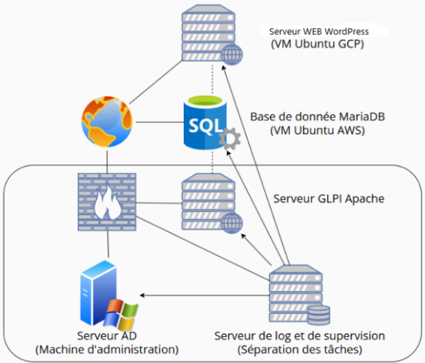
</p>

### Description des composants :
- Serveur Web internet déployé sur GCP 
- Serveur de base de données déployé sur AWS
- Serveur Active Directory déployé sur Proxmox
- Serveur de supervision déployé sur Proxmox
- PfSense déployé sur Proxmox
- Serveur GLPI déployé sur Proxmox


# Déploiement des machines virtuelles


## Serveur Web internet déployé sur GCP : 
Réseau : 34.155.112.213
<p align="center">
    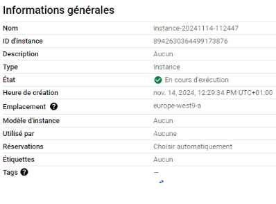
</p>

## Serveur de base de données déployé sur AWS : 
Réseau : 35.180.32.74
<p align="center">
    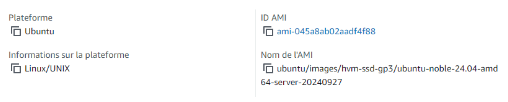
</p>
https://eu-west-3.console.aws.amazon.com/ec2/home?region=eu-west-3#SecurityGroup:group-id=sg-0cf2125fb10c58d68


## Serveur Active Directory déployé sur Proxmox comme VM : 
Réseau: 10.10.0.10/24 gw 10.10.0.1
<p align="center">
    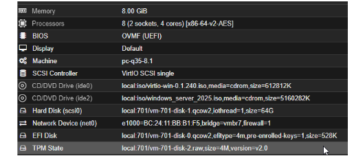
</p>

### Serveur de supervision déployé sur Proxmox sous forme de container LXC
Réseau : 10.10.0.3/24 gw 10.10.0.1
<p align="center">
    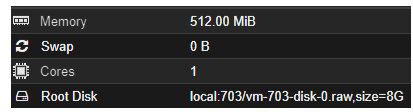
</p>

### PfSense déployé sur Proxmox sous forme de VM : 
WAN (net0) : 10.0.0.70/24 gw 10.0.0.1
LAN (net1) : 10.10.0.1

<p align="center">
    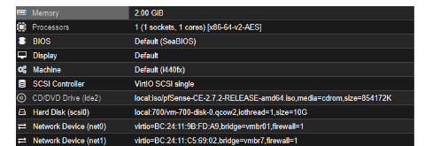
</p>

### Serveur GLPI déployé sur Proxmox sous forme de container LXC
Réseau : 10.10.0.2/24 gw 10.10.0.1

<p align="center">
    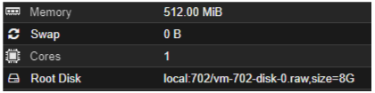
</p>

### Serveur de log déployé sur Proxmox sous forme de container LXC
Réseau : 10.10.0.20./24 gw 10.10.0.1
<p align="center">
    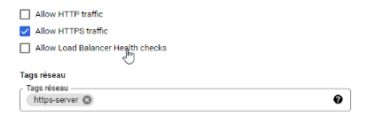
</p>


# Configuration des services

### Serveur Web pour wordpress :
>Installation et configuration d'Apache activation https a2end ssl a2ensite default-ssl.conf

>Ouverture du port 443 sur google cloud pour accès serveur web

>Installation PHP + module

>Déploiement de WordPress

>Téléchargement et décompression wordpress dans /var/www/html

>Adresse srv-bdd : 35.180.32.74
<p align="center">
    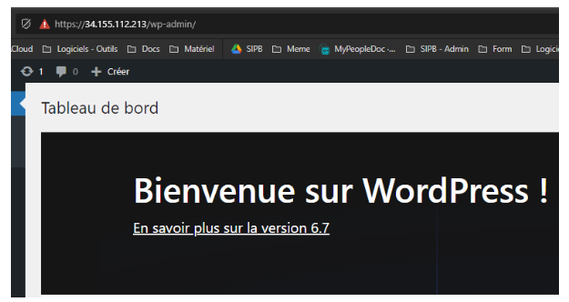
</p>


### Serveur Base de données :
Installation et configuration de MariaDB

#### Création BDD : 
> Nom : dbwp

>User : admidbwp

>MDP : Simplon@is24
<p align="center">
    
</p>
>Ouverture du port 3306 sur AWS
<p align="center">
    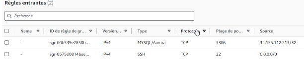
</p>

# Sécurisation de l'infrastructure
### Configuration des pare-feux

## Serveur Web :

>Autoriser via ufw l'accès aux port 443 et 2222 :
``` bash
sudo ufw default deny incoming
sudo ufw default allow outgoing
sudo ufw allow 2222/tcp # Pour SSH
sudo ufw deny 22/tcp # Pour SSH
sudo ufw allow 80,443/tcp # Pour HTTP et HTTPS
sudo ufw enable
sudo systemctl start ufw
```

## Serveur Base de données

>Autoriser via ufw l'accès aux port 3306 et 2222 :
``` bash
sudo ufw default deny incoming
sudo ufw default allow outgoing
sudo ufw allow 2222/tcp # Pour SSH
sudo ufw deny 22/tcp # Pour SSH
sudo ufw allow 3306/tcp # Pour mariadb
sudo ufw allow 10050/tcp # Pour l’agent zabbix
sudo ufw enable
sudo systemctl start ufw
``` 

# Sécurisation SSH

>Modification du port par défaut
<p align="center">
    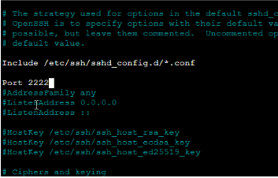
</p>

# Mise en place de Fail2Ban

## Configuration sur les serveurs cloud
>copie du fichier par défaut pour backp
>modif fichier /etc/fail2ban/jail.local
<p align="center">
    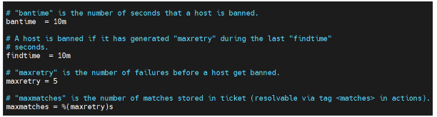
</p>

## Intégration avec PfSense

>Utilisation du paquet pfsense Pfblocker

<p align="center">
    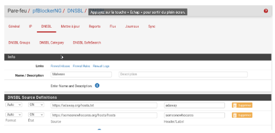
</p>

# Gestion des utilisateurs et des permissions

### Création des comptes utilisateurs avec droits limités

Utilisez la commande usermod pour modifier les paramètres du compte utilisateur. 
``` bash
sudo usermod -aG groupe_specifique nom_utilisateur (ex. ajouter un utilisateur à un groupe)
``` 
### Modifiez les permissions des fichiers et répertoires avec la commande chmod.
#### Pour donner des droits de lecture et d'écriture à l'utilisateur sur un fichier spécifique :
``` bash
sudo chmod u+rw /chemin/vers/fichier
```
#### Utilisez chown pour changer le propriétaire d'un fichier ou répertoire :
``` bash
sudo chown nom_utilisateur:groupe /chemin/vers/fichier
``` 
#### Pour des droits plus avancés, modifiez le fichier sudoers avec la commande visudo :
``` bash
sudo visudo
``` 
>Ajoutez une ligne  pour autoriser l'utilisateur à exécuter des commandes spécifiques avec sudo :

nom_utilisateur ALL=(ALL) /chemin/vers/commande1, /chemin/vers/commande2

>Pour définir des umask spécifiques (ce qui permet de définir les permissions par défaut pour les nouveaux fichiers et répertoires créés dans un système Linux), modifiez le fichier ~/.bashrc de l'utilisateur :
``` bash
echo "umask 027" >> /home/nom_utilisateur/.bashrc
``` 

Ces configurations offrent un contrôle précis sur les droits d'accès de l'utilisateur, en respectant le principe du moindre privilège.

### Politique de mots de passe sécurisés : 
>installer libpam-cracklib
>Modifier le fichier /etc/pam.d/common-password, la ligne contenant cracklib.so :
<p align="center">
    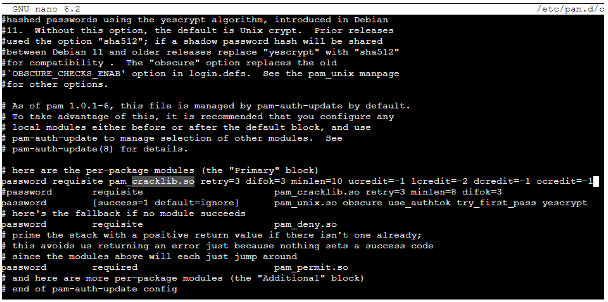
</p>

### Cette configuration impose :

Une longueur minimale de 10 caractères
Au moins 1 majuscule, 2 minuscules, 1 chiffre et 1 caractère spécial

> Modifier ensuite le fichier /etc/login-def, les lignes pass
<p align="center">
    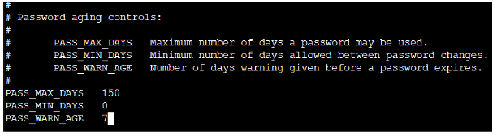
</p>

Cette configuration force les changements de mots de passe tous les 150 jours avec un délai de prévenance de 7 jours

# Configuration de chage sur Ubuntu
<p align="center">
    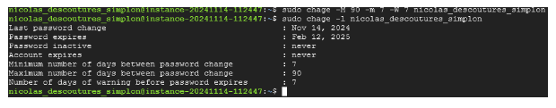
</p>


# Installation des outils de surveillance

##  Mise en place de la supervision
Nous avons décidé d'utiliser ZABBIX pour le materiel:
<p align="center">
    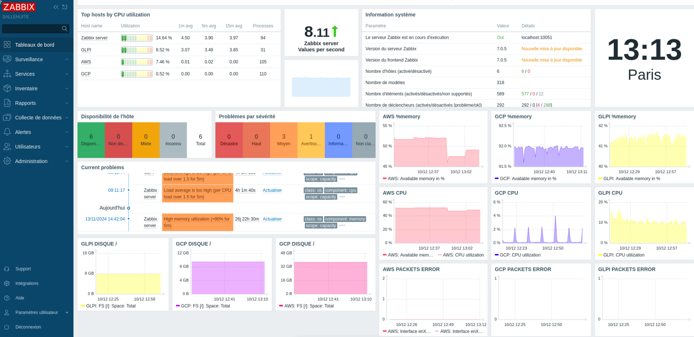
</p>
et GRAYLOG avec NxLog pour la collecte des logs
<p align="center">
    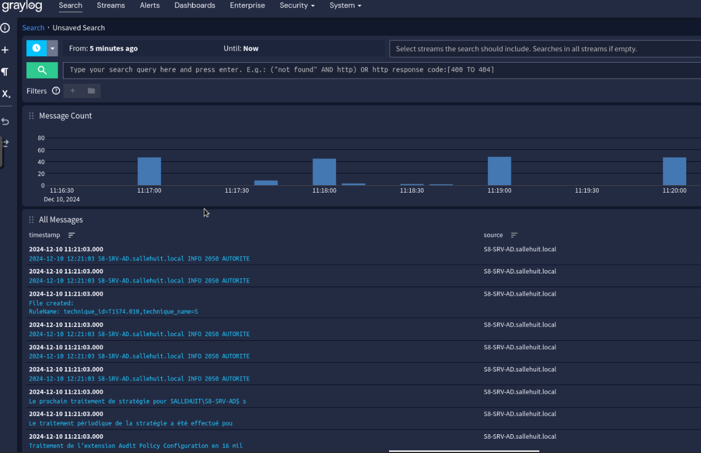
</p>


## Configuration de la collecte de logs avec Graylog

### Fichier de configuration de nxlog sur windows server : 
<p align="center">
    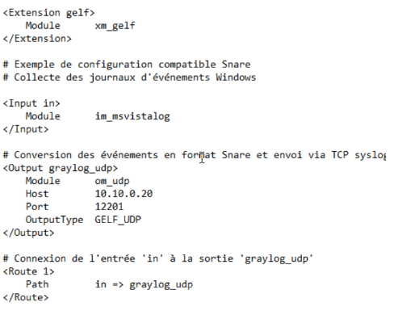
</p>

### Mise en place des alertes bruteforce rdp (gpo pour paramétrer)
<p align="center">
    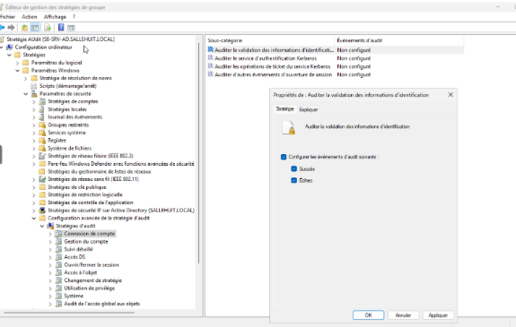
</p>

### Visualisation sur GRAYLOG : 
<p align="center">
    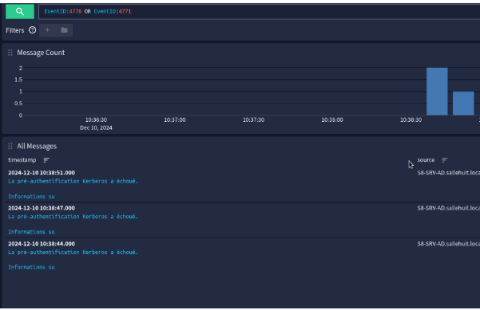

# Conclusion
#### Récapitulatif des difficultés : 
- Liaison du serveur web vers la base de données (connexion mariadb interne)
- Mise en place des remonté des log sur un serveur centralisé, nous aurions peut être pu avec plus de temps les faires remonter sur le dashboard de ZABBIX en cas d’alertes


>© Nicolas.D, Michael.B, Loïc.J egalement accompagné par la pompomgirl Francesca.E.