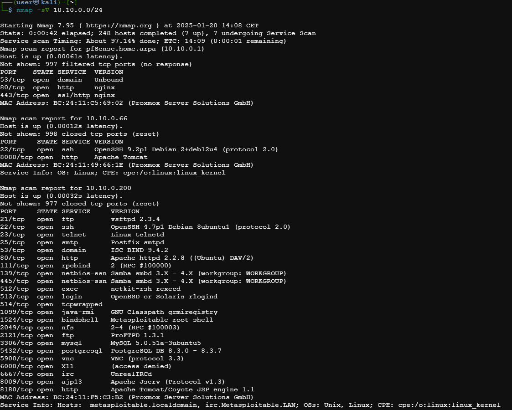

# Pentest sur la machine Metasploit 2

## Scan du réseau pour identifier les machines et les ports ouverts

##### La machine Metasploit 10.10.0.200 est identifiée ci-dessus.

## Rapport de Scan Nmap - Hôte 10.10.0.200

### Informations Générales

- **Hôte actif** : Oui (latence de 0.00032s)
- **Adresse MAC** : BC:24:11:F5:C3:B2 (Proxmox Server Solutions GmbH)
- **Nom d'hôte** : metasploitable.localdomain, irc.Metasploitable.LAN
- **Systèmes d'exploitation détectés** : Unix, Linux
- **CPE** : cpe:/o:linux:linux_kernel

### Résumé des Ports Ouverts
Le scan a identifié plusieurs ports ouverts sur l'hôte 10.10.0.200, dont certains sont associés à des services courants qui peuvent présenter des vulnérabilités.

| Port   | État | Service            | Version                                                      |
|--------|------|--------------------|--------------------------------------------------------------|
| 21/tcp | Ouvert | FTP                | vsftpd 2.3.4                                                  |
| 22/tcp | Ouvert | SSH                | OpenSSH 4.7p1 Debian 8ubuntu1 (protocole 2.0)                  |
| 23/tcp | Ouvert | Telnet             | Linux telnetd                                                |
| 25/tcp | Ouvert | SMTP               | Postfix smtpd                                                |
| 53/tcp | Ouvert | DNS                | ISC BIND 9.4.2                                               |
| 80/tcp | Ouvert | HTTP               | Apache httpd 2.2.8 (Ubuntu) DAV/2                             |
| 111/tcp| Ouvert | RPCBIND            | Version 2 (RPC #100000)                                       |
| 139/tcp| Ouvert | NetBIOS-SSN        | Samba smbd 3.X - 4.X (workgroup: WORKGROUP)                   |
| 445/tcp| Ouvert | NetBIOS-SSN        | Samba smbd 3.X - 4.X (workgroup: WORKGROUP)                   |
| 512/tcp| Ouvert | Exec               | netkit-rsh rexecd                                             |
| 513/tcp| Ouvert | Login              | OpenBSD ou Solaris rlogind                                    |
| 514/tcp| Ouvert | TCPWrapped         | -                                                            |
| 1099/tcp| Ouvert | Java-RMI           | GNU Classpath grmiregistry                                    |
| 1524/tcp| Ouvert | Bindshell          | Metasploitable root shell                                     |
| 2049/tcp| Ouvert | NFS                | Versions 2-4 (RPC #100003)                                    |
| 2121/tcp| Ouvert | FTP                | ProFTPD 1.3.1                                                 |
| 3306/tcp| Ouvert | MySQL              | MySQL 5.0.51a-3ubuntu5                                        |
| 5432/tcp| Ouvert | PostgreSQL         | PostgreSQL DB 8.3.0 - 8.3.7                                   |
| 5900/tcp| Ouvert | VNC                | VNC (protocole 3.3)                                           |
| 6000/tcp| Ouvert | X11                | Accès refusé                                                  |
| 6667/tcp| Ouvert | IRC                | UnrealIRCd                                                   |
| 8009/tcp| Ouvert | AJP13              | Apache Jserv (Protocol v1.3)                                  |
| 8180/tcp| Ouvert | HTTP               | Apache Tomcat/Coyote JSP engine 1.1                           |

### Services et Vulnérabilités Potentielles
1. **vsftpd 2.3.4 (FTP)** : Cette version est connue pour une vulnérabilité permettant l'exécution de code à distance.
2. **OpenSSH 4.7p1** : Version obsolète, susceptible de comporter des vulnérabilités non corrigées.
3. **Samba smbd 3.X - 4.X** : Certaines versions de Samba présentent des failles permettant l'exécution de code à distance.
4. **Metasploitable root shell** : Le port 1524 est particulièrement préoccupant, car il donne accès à un shell root sur Metasploitable, souvent utilisé pour des tests d'exploitation.

### Recommandations
- **Mettre à jour les services vulnérables** : Les versions de **vsftpd**, **OpenSSH**, et **Samba** doivent être mises à jour pour éliminer les vulnérabilités connues.
- **Restreindre l'accès aux services sensibles** : Il est conseillé de désactiver ou de sécuriser avec des mécanismes d'authentification forts des services comme **Telnet**, **FTP**, et **rlogin**, qui transmettent des informations en clair.
- **Configurer un pare-feu** : Limiter l'accès aux ports sensibles, notamment **21 (FTP)**, **22 (SSH)**, et **80 (HTTP)**, selon les besoins réels.

---
*Rapport généré à partir d'un scan Nmap effectué sur l'hôte 10.10.0.200.*
