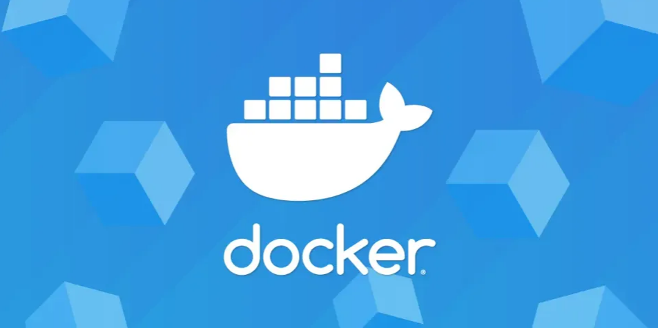

    

## 📌 1. Qu'est-ce que Docker ?  
Docker est une plateforme open-source qui permet de **créer, déployer et exécuter des applications dans des conteneurs**.  
Un conteneur est une unité légère, portable et autonome qui embarque tout ce dont une application a besoin pour fonctionner (code, bibliothèques, dépendances, etc.).  

Contrairement aux machines virtuelles (VMs), Docker utilise le noyau du système hôte pour exécuter ses conteneurs, ce qui permet une meilleure performance et une consommation réduite des ressources.

---

## 🔑 2. Les concepts clés de Docker  

### 📦 2.1. Image  
Une image est un **modèle immuable** utilisé pour créer des conteneurs.  
Elle contient le code de l’application et ses dépendances.  
Les images sont stockées et partagées via **Docker Hub** ou des registres privés.

### 🛳️ 2.2. Conteneur  
Un conteneur est une **instance d’une image** en cours d’exécution.  
Il est isolé du système hôte et des autres conteneurs, mais partage le même noyau.

### ⚙️ 2.3. Dockerfile  
Le **Dockerfile** est un fichier texte contenant les instructions pour construire une image Docker.  
Il permet d'automatiser la création d’images.

### 📜 2.4. Registry (Docker Hub, GitHub Container Registry, etc.)  
Un **registry** est un dépôt en ligne où les images Docker sont stockées et partagées.  
**Docker Hub** est le plus utilisé, mais il existe aussi des alternatives comme **GitHub Container Registry** ou des solutions auto-hébergées comme **Harbor**.

### 🔄 2.5. Docker Compose  
Docker Compose permet de **définir et gérer des applications multi-conteneurs** à l’aide d’un fichier `docker-compose.yml`.  
Il est utile pour orchestrer plusieurs services (ex : base de données, backend, frontend).

### ☸️ 2.6. Orchestration avec Docker Swarm et Kubernetes  
- **Docker Swarm** : Outil natif pour gérer un cluster de conteneurs.  
- **Kubernetes** : Système plus avancé et populaire pour l’orchestration de conteneurs à grande échelle.

---

## ✅ 3. Avantages et inconvénients de Docker  

### ✔️ Avantages  
✅ **Portabilité** : Fonctionne sur n'importe quel environnement (dev, test, prod).  
✅ **Isolation** : Chaque conteneur est indépendant, limitant les conflits entre applications.  
✅ **Léger et performant** : Contrairement aux machines virtuelles, Docker ne nécessite pas un OS complet par conteneur.  
✅ **Facilité de mise à l’échelle** : Compatible avec Kubernetes et d'autres outils d’orchestration.  
✅ **Automatisation et CI/CD** : Intégration facile dans les pipelines DevOps.

### ❌ Inconvénients  
⚠️ **Sécurité** : Partage du noyau du système hôte, ce qui peut poser des risques.  
⚠️ **Gestion des données persistantes** : Le stockage des données peut être plus complexe qu'avec des VM.  
⚠️ **Courbe d'apprentissage** : Nécessite une adaptation et une bonne compréhension des concepts sous-jacents.  
⚠️ **Orchestration avancée nécessaire** : Pour les applications complexes, Docker seul ne suffit pas, et Kubernetes est souvent requis.

---

## 🔗 4. Ressources utiles  

📖 **Documentation officielle Docker** : [https://docs.docker.com/](https://docs.docker.com/)  
🎓 **Tutoriels Docker pour débutants** : [https://docker-curriculum.com/](https://docker-curriculum.com/)  
📂 **Docker Hub (dépôt d’images)** : [https://hub.docker.com/](https://hub.docker.com/)  

---