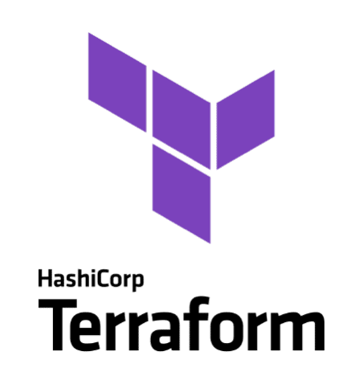

    

# Concepts de base de TERRAFORM

## Qu'est-ce que Terraform ?
- Un outil d'Infrastructure as Code (IaC) développé par HashiCorp.
- Permet de définir, déployer et gérer l'infrastructure avec un fichier texte.
- Supporte de nombreux fournisseurs comme AWS, Azure, Google Cloud, VMware, etc.

## Principaux concepts :
- Providers : Interfaces pour interagir avec les API des services (ex. AWS, Azure).
- Resources : Objets que Terraform va créer ou gérer (ex. une machine virtuelle, un réseau).
- Modules : Groupes de ressources pour réutiliser des configurations.
- State File : Fichier qui stocke l'état actuel de l'infrastructure.
- Plan & Apply : Le plan montre les modifications nécessaires, et apply les exécute.

### Documentation officielle :

- [Introduction to Terraform](https://developer.hashicorp.com/terraform/docs)

