## Ressources

Wireshark Gestes professionnels HTTP, TLS et certificats X509

## Contexte

Il vous est demandé de procéder à l'analyse des protocoles utilisés sur le réseau et de détecter d'éventuelles faiblesses.

à partir du Lab installé, ajouter les services nécessaires et répondre aux questions suivantes

## Rappels

``` Quelle est votre adresse IP ? Quelle est sa classe (IPv4) ? ```

10.0.0.220 CLasse A

```` Quel est votre masque de sous-réseau ? ````

/24 (255.255.255.0)

``Quelle est l'adresse de votre passerelle ?``

10.0.0.254

<p align="center">
    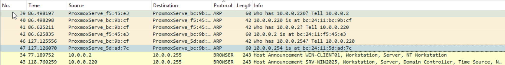
</p>

## Questions

``` Quels sont les flags TCP ?  ```

1. SYN : Utilisé pour demander l’établissement d’une session.
2. ACK : Utilisé pour acquitter la bonne réception de la confirmation.
3. FIN : Utilisé pour mettre fin à la session.
4. URG : Signale la présence de données urgentes.
5. PSH : Utilisé pour demander une transmission immédiate des données.
6. RST : Utilisé pour réinitialiser la connexion.

``` Capturer le processus DORA du protocole DHCP ``` 
<p align="center">
    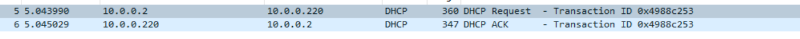
</p>

````Qu’est ce que le DHCP Starvation / snooping ? Rogue DHCP ?````

1. DHCP Starvation est une attaque qui cible généralement les serveurs DHCP du réseau, dans le but d’inonder le serveur DHCP autorisé de messages de demandes DHCP REQUEST en utilisant des adresses MAC source spoofées. Le serveur DHCP répondra à toutes les demandes, sans savoir qu’il s’agit d’une attaque. Cette attaque peut entraîner un déni de service (DoS) ou une attaque "Man in the middle" (MITM).

2. DHCP Snooping est une technologie de sécurité de couche 2 du modèle OSI intégrée dans le système d’exploitation d’un commutateur réseau. Il empêche les serveurs DHCP non autorisés de distribuer des adresses IP aux clients DHCP. DHCP Snooping valide les messages DHCP provenant de sources non fiables et filtre les messages invalides1. Il construit et maintient la base de données de liaison DHCP Snooping, qui contient des informations sur les hôtes non fiables avec des adresses IP louées.

3. Un serveur Rogue DHCP est un serveur DHCP sur un réseau qui n’est pas sous le contrôle administratif du personnel du réseau. Il s’agit d’un dispositif réseau tel qu’un modem ou un routeur connecté au réseau par un utilisateur qui peut être soit inconscient des conséquences de ses actions, soit peut l’utiliser sciemment pour des attaques de réseau telles que "Man in the middle". Un serveur DHCP voyou est généralement introduit accidentellement dans le réseau. Lorsqu’un serveur DHCP voyou existe dans le réseau, certains des clients peuvent être incapables de naviguer sur le web ou d’accéder à d’autres ressources du réseau

``` Que ce passe lors du « ipconfig /release » (windows) ? D’un point de vue sécurité quel peut etre l'enjeu ? ``` 

Du point de vue de la sécurité, cette commande peut être utile dans plusieurs scénarios. Par exemple, si vous rencontrez des problèmes de connectivité ou des conflits d’adresses IP, la libération et le renouvellement de votre adresse IP peuvent souvent résoudre ces problèmes. Cependant, il est important de noter que si un attaquant a accès à votre ordinateur et peut exécuter cette commande, il pourrait potentiellement interrompre votre connexion réseau ou causer d’autres problèmes.

``` Quelle fonctionnalité propose CISCO pour se prémunir des attaques DHCP ? ``` 

1. DHCP Snooping : Il s’agit d’une technologie qui agit comme un pare-feu entre les hôtes non fiables et les serveurs DHCP de confiance. Il valide les messages DHCP reçus de sources non fiables et filtre les messages invalides. Il construit et maintient la base de données de liaison DHCP Snooping, qui contient des informations sur les hôtes non fiables avec des adresses IP louées.

2. DHCP Anti-Attack : Cette fonctionnalité permet de surveiller les paquets DHCP atteignant un appareil. Vous pouvez configurer un seuil de taux DHCP pour surveiller les paquets. Si le taux de paquets est égal ou supérieur au seuil, alors les paquets sont considérés comme une attaque et sont rejetés.

3. IP Source Guard (IPSG) : Cette fonctionnalité prévient les attaques de spoofing d’adresses MAC et IP.

4. Dynamic ARP Inspection (DAI) : Cette fonctionnalité prévient les attaques de spoofing ARP et les attaques d’empoisonnement ARP.

``` Capturer une requête DNS et sa réponse ```
 <p align="center">
    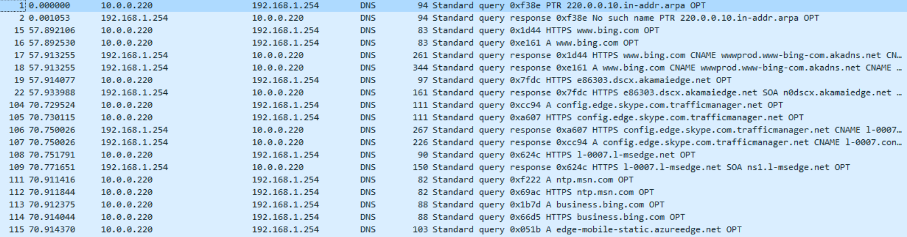
</p>

``` Qu’est-ce que le DNS Spoofing ? Comment s’en protéger ? ``` 

Le DNS Spoofing, également appelé empoisonnement du cache DNS, est une forme d’attaque informatique dans laquelle des données corrompues du système de noms de domaine (DNS) sont introduites dans le cache du résolveur DNS. Cela provoque le renvoi d’un enregistrement de résultat incorrect par le serveur de noms, par exemple, une adresse IP. En d’autres termes, ces types d’attaques exploitent les vulnérabilités des serveurs de noms de domaine et redirigent le trafic vers des sites web illégitimes.

Pour se protéger contre le DNS Spoofing, voici quelques mesures que vous pouvez prendre :

Mise en place de DNSSEC : Les extensions de sécurité du système de noms de domaine (DNSSEC) sont largement utilisées pour protéger le registre du serveur contre les manipulations extérieures3.
Recherche du symbole de connexion sécurisée : Naviguer sur Internet en toute sécurité est facilité par le symbole de connexion sécurisée qui indique qu’une page est authentique3.
Application régulière de correctifs aux serveurs DNS : Il est important de maintenir vos serveurs DNS à jour avec les derniers correctifs de sécurité.
Filtrage approfondi du trafic DNS : Effectuez un filtrage approfondi du trafic DNS pour détecter et bloquer les activités suspectes.
Contrôlez vos propres serveurs DNS : Vous possédez les informations stockées à la suite de chaque requête, et vous pouvez les vérifier pour leur qualité et leur authenticité selon un calendrier que vous définissez5.
Gestion des accès privilégiés (PAM) et authentification multi-facteurs (MFA) : Les serveurs peuvent être protégés en autorisant spécifiquement certains utilisateurs et appareils de confiance.
Il est important de noter que ces mesures ne garantissent pas une protection à 100% contre le DNS Spoofing, mais elles peuvent grandement contribuer à réduire le risque.

``` Qu’est-ce que DNS Sec ? DNS over TLS / HTTPS ? ``` 

1. DNSSEC (Domain Name System Security Extensions) est un protocole qui ajoute des signatures cryptographiques aux enregistrements DNS pour vérifier leur authenticité et empêcher leur altération12. Il a été conçu pour augmenter la confidentialité et la sécurité des utilisateurs en empêchant l’écoute clandestine et la manipulation des données DNS via des attaques de type homme du milieu.

2. DNS over TLS (DoT) est un protocole de sécurité réseau pour chiffrer et encapsuler les requêtes et les réponses du système de noms de domaine (DNS) via le protocole de sécurité de la couche de transport (TLS). DoT utilise le même protocole de sécurité, TLS, que les sites Web HTTPS utilisent pour chiffrer et authentifier les communications. De plus, il garantit que les requêtes et les réponses DNS ne sont pas altérées ou falsifiées par des attaques sur le trajet.

3. DNS over HTTPS (DoH) est une alternative à DoT. Avec DoH, les requêtes et les réponses DNS sont chiffrées, mais elles sont envoyées via les protocoles HTTP ou HTTP/2 au lieu de directement sur UDP. Comme DoT, DoH garantit que les attaquants ne peuvent pas falsifier ou altérer le trafic DNS. Le trafic DoH ressemble à d’autres trafics HTTPS - par exemple, des interactions utilisateur normales avec des sites Web et des applications Web - du point de vue d’un administrateur réseau.

Ces protocoles visent à améliorer la sécurité et la confidentialité des utilisateurs en chiffrant les requêtes DNS, ce qui empêche les tiers d’intercepter et de lire ces requêtes.

``` Dans quels cas trouve-t-on du DNS sur TCP ? ``` 

1. Transferts de zone (AXFR/IXFR) : Le DNS utilise TCP pour transférer des enregistrements DNS entiers entre les serveurs. Cela est nécessaire pour maintenir une base de données DNS cohérente entre les serveurs DNS.

2. DNSSEC : Les extensions de sécurité DNS nécessitent un échange de données supplémentaires, ce qui est géré par TCP.

3. Réponses tronquées : Si une réponse DNS ne peut pas tenir dans un paquet UDP, elle est tronquée, signalant au client de retransmettre en utilisant TCP.

4. Données de plus de 512 octets : TCP doit être utilisé pour échanger des informations plus grandes que 512 octets.

5. Retransmission après échec : Si un client ne reçoit pas de réponse de DNS, il doit retransmettre les données en utilisant TCP après un intervalle de 3 à 5 secondes.

``` Capturer un flux HTTP ``` 

 <p align="center">
    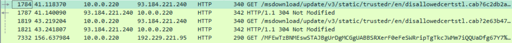
</p>

``` Qu’est-ce que le HTTP Smuggling ? Donner un exemple de CVE ``` 

Le HTTP Smuggling, ou contrebande de requêtes HTTP, est une technique d’attaque qui interfère avec la façon dont un site web traite les séquences de requêtes HTTP reçues d’un ou plusieurs utilisateurs. Cette technique exploite l’incohérence entre l’interprétation des en-têtes Content-Length et Transfer-Encoding entre les implémentations de serveurs HTTP dans une chaîne de serveurs proxy HTTP. Les vulnérabilités de contrebande de requêtes sont souvent critiques, permettant à un attaquant de contourner les contrôles de sécurité, d’accéder sans autorisation à des données sensibles et de compromettre directement d’autres utilisateurs de l’application.

Un exemple de vulnérabilité liée au HTTP Smuggling est le CVE-2023-25690. Il s’agit d’une vulnérabilité critique affectant certaines configurations de mod_proxy sur les versions 2.4 à 2.4.55 du serveur HTTP Apache. Cette vulnérabilité permet aux attaquants d’exécuter des attaques de contrebande de requêtes HTTP, potentiellement en contournant les contrôles d’accès, en proxyant des URL non intentionnelles et en empoisonnant les caches.

``` Comment mettre en place la confidentialité et l'authenticité pour HTTP ? ``` 

1. Utiliser HTTPS : HTTPS est une version sécurisée de HTTP qui utilise le protocole TLS (Transport Layer Security) pour chiffrer les communications entre le client et le serveur. Cela garantit que les données transmises ne peuvent pas être lues ou modifiées par des tiers.

2. Obtenir un certificat TLS : 
Pour utiliser HTTPS, vous devez obtenir un certificat TLS pour votre site web. Ce certificat est délivré par une autorité de certification et prouve que votre site web est authentique et que les communications sont sécurisées.

3. Rediriger HTTP vers HTTPS : 
Pour garantir que toutes les communications sont sécurisées, vous pouvez configurer votre serveur pour rediriger automatiquement toutes les requêtes HTTP vers HTTPS.

4. Utiliser l’authentification HTTP : 
L’authentification HTTP peut être utilisée pour vérifier l’identité des utilisateurs avant de leur permettre d’accéder à certaines ressources. Cela peut être réalisé en utilisant des techniques telles que l’authentification de base, l’authentification par digest, ou en utilisant des jetons d’authentification.

5. Activer la sécurité stricte du transport (HSTS) :
 HSTS est une politique de sécurité qui force les navigateurs à n’utiliser que des connexions HTTPS. Cela aide à prévenir les attaques de type “homme du milieu”.

6. Utiliser des cookies sécurisés : 
Les cookies sécurisés sont des cookies qui sont transmis uniquement sur des connexions HTTPS. Cela aide à prévenir le vol de cookies qui pourrait permettre à un attaquant de usurper l’identité d’un utilisateur.
Il est important de noter que ces mesures ne garantissent pas une protection à 100% contre toutes les menaces, mais elles peuvent grandement contribuer à améliorer la sécurité de votre site web.

``` Qu’est-ce qu’une PKI ? ``` 

Une PKI (Public Key Infrastructure) est un système pour gérer les certificats numériques et le chiffrement à clé publique. Elle facilite le transfert sécurisé d’informations pour diverses activités réseau.

``` Capturer un mot de passe HTTP ou FTP ou Telnet (mettre en place les services si nécessaire) ``` 
 <p align="center">
    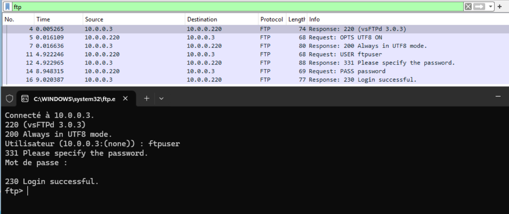
</p>

```Comment mettre en place la confidentialité pour ce service ?``` 

En mettant en place du chiffrement, en activant SSL/TLS et en utilisant des certificats pour le cryptage des données.

``` Capturer un handshake TLS ``` 

 <p align="center">
    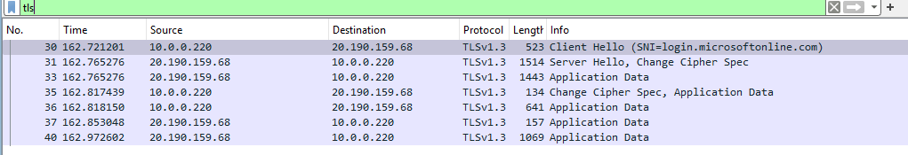
</p>

``` Déchiffrer le trafic TLS avec votre certificat et/ou votre clé de session ``` 

 <p align="center">
    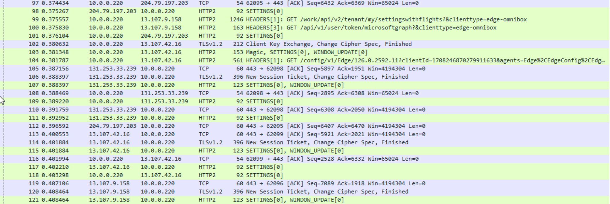
</p>

``` Qu’est-ce qu’une autorité de certification (AC) racine ? Qu'est qu'une AC intermediaire ? ``` 

Autorité de Certification (AC) Racine :

Définition : AC au sommet de la hiérarchie, auto-signée et implicitement digne de confiance.
Fonctions :
Émet des certificats pour les AC intermédiaires et parfois pour les entités finales.
Certificat auto-signé.
La sécurité de toute la hiérarchie repose sur elle.
Autorité de Certification (AC) Intermédiaire :

Définition : AC certifiée par une AC racine ou une autre AC intermédiaire.
Fonctions :
Délègue la confiance de l'AC racine.
Émet des certificats pour les entités finales ou d'autres AC intermédiaires.
Permet une gestion plus sécurisée et granulaire des certificats.
Comparaison et Interaction :

Hiérarchie :
AC Racine : Au sommet, émet des certificats pour plusieurs AC intermédiaires.
AC Intermédiaire : Sous l'AC racine, émet des certificats pour les entités finales ou d'autres intermédiaires.
Sécurité :
AC Racine : Critiquement sécurisée.
AC Intermédiaire : Limite les risques par rapport à l'AC racine.
Confiance :
AC Racine : Confiance préinstallée dans les systèmes.
AC Intermédiaire : Confiance dérivée de l'AC racine.
Exemple d'Utilisation :

Lors de la connexion à un site web sécurisé, le navigateur vérifie la chaîne de certification : certificat du site web -> AC intermédiaire -> AC racine.
Conclusion
AC Racine : Critique et au sommet de la hiérarchie, auto-signée.
AC Intermédiaire : Émise par une AC racine, permettant une gestion flexible et sécurisée des certificats.
La combinaison de ces AC assure une infrastructure sécurisée pour la gestion des identités et des communications sur les réseaux.

``` Connectez-vous sur https://taisen.fr et affichez la chaine de confiance du certificat ``` 

 <p align="center">
    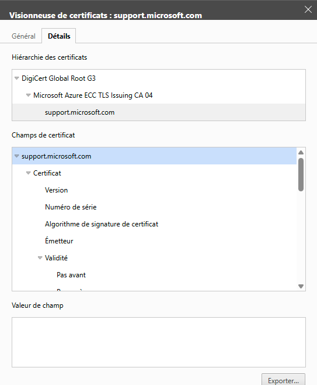
</p>

``` Capturer une authentification Kerberos (mettre en place le service si nécessaire)``` 

 <p align="center">
    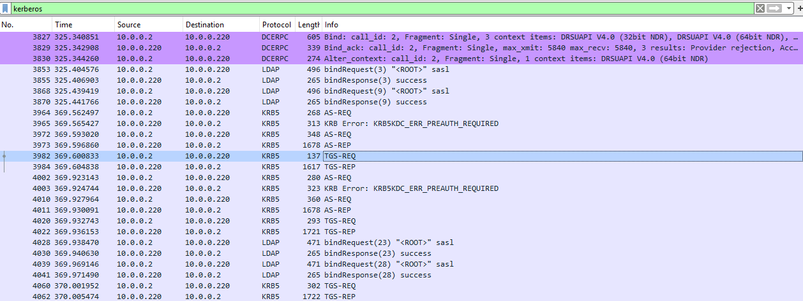
</p>

``` Capturer une authentification RDP (mettre en place le service si nécessaire)``` 

 <p align="center">
    
</p>

``` Quelles sont les attaques connues sur NetLM ?``` 

1. Attaque par relais NTLM (NTLM Relay Attack)
Description : L'attaquant intercepte et relaye des messages d'authentification NTLM pour accéder à des services avec les privilèges de l'utilisateur capturé.
Contre-mesures :
Activer la signature SMB (SMB Signing)
Utiliser Kerberos pour l'authentification
Restreindre ou désactiver l'utilisation de NTLM via des stratégies de groupe

2. Pass-the-Hash (PtH)
Description : L'attaquant utilise la valeur de hachage NTLM d'un utilisateur pour s'authentifier sans connaître le mot de passe en clair.
Contre-mesures :
Utiliser des mots de passe complexes et uniques
Activer la protection des comptes LSA (Local Security Authority)
Utiliser des mots de passe uniques pour les comptes administrateurs locaux sur chaque machine

3. Brute Force et Rainbow Tables
Description : Utilisation de dictionnaires de mots de passe ou de tables arc-en-ciel pour casser les hachages NTLM.
Contre-mesures :
Utiliser des mots de passe longs et complexes
Configurer des politiques de verrouillage de compte après plusieurs tentatives échouées

4. Cracking des défis/réponses NTLM (NTLM Challenge/Response Cracking)
Description : Capturer et analyser les défis/réponses NTLM pour trouver le mot de passe en clair.
Contre-mesures :
Utiliser des protocoles chiffrés pour le trafic réseau (comme TLS)
Préférer Kerberos pour l'authentification

5. Attaques de downgrade
Description : Forcer l'utilisation de versions moins sécurisées de NTLM (comme NTLMv1) en manipulant les négociations de protocole.
Contre-mesures :
Configurer les systèmes pour refuser les versions antérieures à NTLMv2
Activer la signature SMB pour protéger l'intégrité des messages de négociation

``` Capturer une authentification WinRM (Vous pouvez utiliser EvilWinRM si nécessaire côté client.)``` 

 <p align="center">
    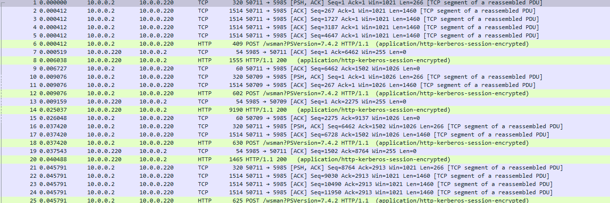
</p>

``` Capturer une authentification SSH ou SFTP (mettre en place le service si nécessaire)``` 

 <p align="center">
    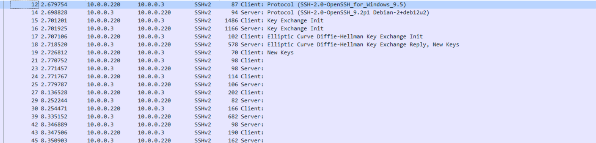
</p>

``` Intercepter un fichier au travers du protocole SMB ``` 

<p align="center">
    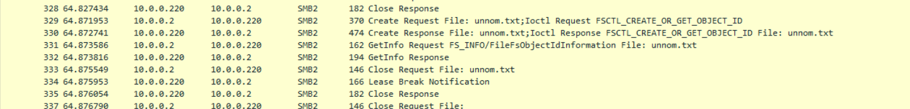
</p>

``` Comment proteger l'authenticité et la confidentialité d'un partage SMB ? ``` 

1. SMB 3.0 ou supérieur : Utilisez les versions les plus récentes de SMB pour bénéficier de fonctionnalités de sécurité avancées.

2. Chiffrement : Activez le chiffrement SMB pour protéger les données en transit.

3. Authentification sécurisée : Utilisez NTLMv2 ou Kerberos pour l'authentification.

4. Pare-feu et filtrage : Limitez l'accès aux partages SMB à des adresses IP de confiance.

5. Permissions : Configurez soigneusement les permissions pour limiter l'accès aux utilisateurs autorisés.

6. Mises à jour : Maintenez vos systèmes à jour avec les derniers correctifs de sécurité.

7. Surveillance : Utilisez des outils de surveillance pour détecter les accès non autorisés.


```Reconstituer un fichier qui à transité sur le réseau à l'aide de Wireshark ```

<p align="center">
    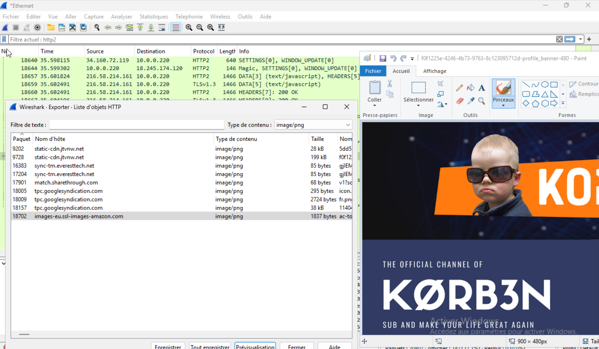
</p>