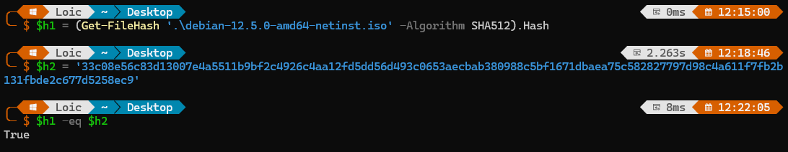
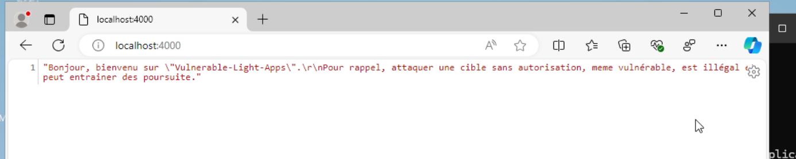
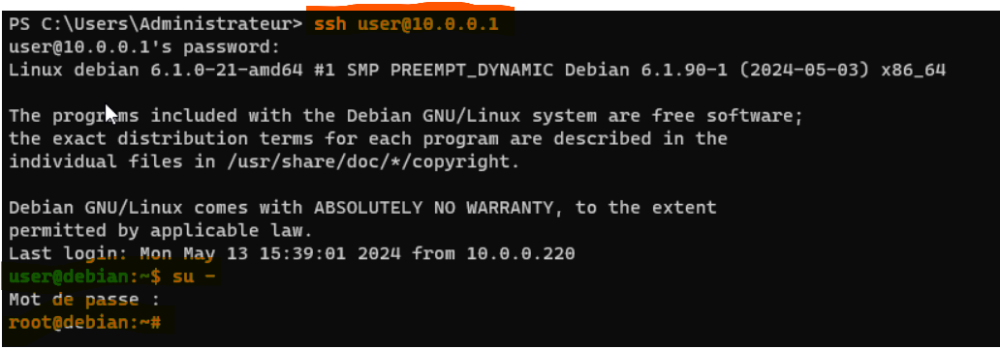
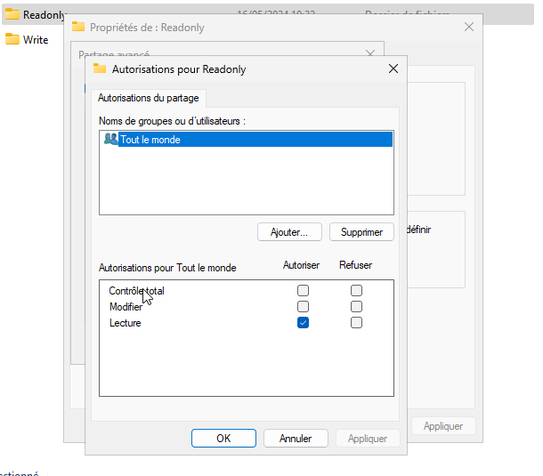
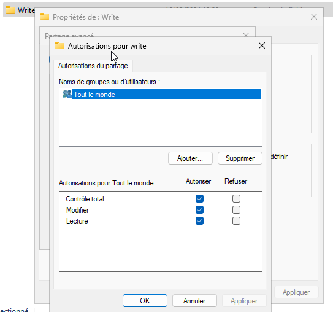
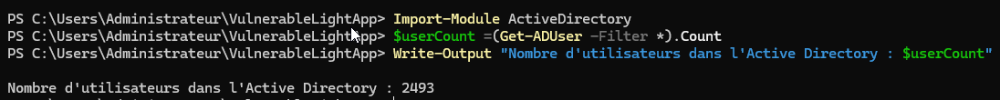

## Verifier HASH

    

## Status DNS

    

    

## Serveur WEB

    

## Connection SSH

    

## Status et connextion WINRM

    

    

## Partage RO & WO

    

    

## Compte AD

    

