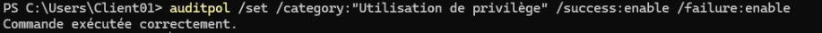
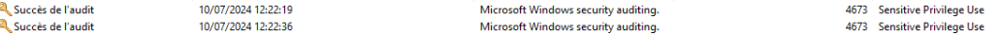
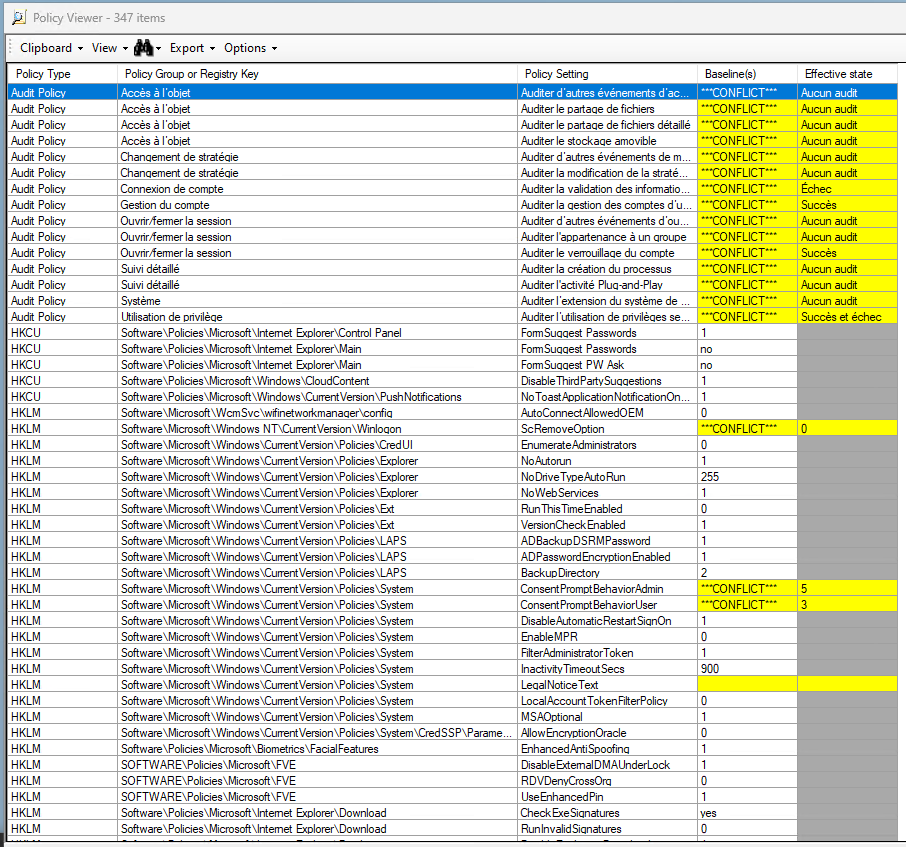
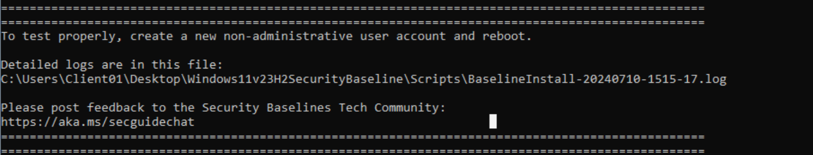
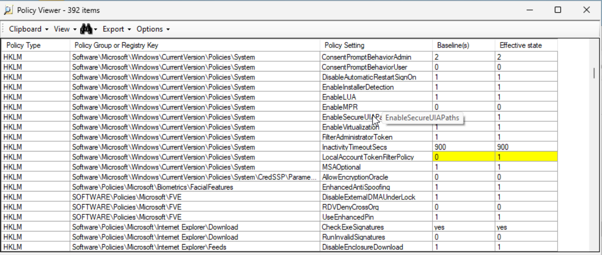

# Contexte
Un de vos collaborateurs par à l'étranger et il vous est demandé de lui fournir une machine vierge de toute donnée, bénéficiant d'un niveau de sécurité acceptable afin qu'il puisse consulter ses mails sur Office 365 durant son déplacement.

## Ressources
MSCT
auditpol
Gestes professionnels


## Modalités pédagogiques

Installer une Machine Windows (VM) cliente et ne PAS joindre l'Active Directory.

## Liste toutes les sous-catégories
```Powershell
auditpol /list /subcategory:*
```

## Configurer auditpol pour logger les erreurs d'authentification et les escalades de privilèges
```Powershell
auditpol /set /category:"Connexion de compte" /failure:enable
```
<p align="center">
    
</p>

```Powershell
auditpol /set /subcategory:"Ouvrir la session" /failure:enable
```
<p align="center">
    
</p>

## Configurer auditpol pour logger les escalades de privilèges

```Powershell
auditpol /set /category:"Utilisation de privilège" /success:enable /failure:enable
```
<p align="center">
    
</p>

<p align="center">
    
</p>

## Prouver la bonne configuration d'auditpol en retrouvant les evenements dans les logs

<p align="center">
    
</p>

## Se documenter sur LGPO et comparer votre GPO actuelle à celle recommandée grace à PolicyAnalyzer.

<p align="center">
    
</p>


## Comprendre puis exécuter le script de durcissement.

Ce script PowerShell est conçu pour appliquer une configuration de sécurité de base de Windows à la politique de groupe locale. Il prend en charge plusieurs commutateurs de ligne de commande pour installer la configuration de base correspondante pour différentes versions de Windows et différents scénarios d’adhésion au domaine.

## Paramètres : Le script nécessite un paramètre obligatoire pour déterminer quel ensemble de politiques de base appliquer. Les options sont :
- Win11DomainJoined : Pour Windows 11, adhérent au domaine.
- Win11NonDomainJoined : Pour Windows 11, non adhérent au domaine.
- WSMember : Pour Windows Server, serveur membre adhérent au domaine.
- WSNonDomainJoined : Pour Windows Server, non adhérent au domaine.
- WSDomainController : Pour Windows Server, contrôleur de domaine.


> Vérification du type de système d’exploitation : Le script vérifie si le système d’exploitation est un contrôleur de domaine. Si c’est le cas, le script s’arrête car il n’est pas conçu pour être exécuté sur un contrôleur de domaine.

> Application des politiques de base : En fonction du paramètre fourni, le script détermine quel ensemble de politiques de base appliquer. Il utilise une fonction AddToCollection pour ajouter les - politiques appropriées à une collection qui sera ensuite appliquée.

> Vérification de l’outil LGPO.exe : Le script nécessite l’outil LGPO.exe pour appliquer les politiques de base. Il vérifie si l’outil est disponible dans le chemin d’accès spécifié. Si ce n’est pas le cas, le script s’arrête.

> Journalisation : Le script crée un fichier journal pour enregistrer les détails de son exécution. Il définit plusieurs fonctions pour faciliter la journalisation et l’affichage de la progression.

<p align="center">
    
</p>

## Vérifier la configuration avec PolicyAnalyzer

<p align="center">
    
</p>

## Activer le chiffrement de surface (bitlocker recommandé)

<p align="center">
    
</p>

## Renforcer la configuration Antivirus à l'aide de powershell

### Vérifier la configuration actuelle de Windows Defender
```bash
Get-MpPreference
```

### Activer la protection en temps réel
```Powershell
Set-MpPreference -DisableRealtimeMonitoring $false
```

### Activer la protection basée sur le cloud
```Powershell
Set-MpPreference -MAPSReporting Advanced
Set-MpPreference -SubmitSamplesConsent SendAllSamples
```

### Activer l'accès contrôlé aux dossiers (Protection contre les ransomwares)
```Powershell
Set-MpPreference -EnableControlledFolderAccess Enabled
```

## Créer une tâche planifiée pour effectuer des analyses régulières en utilisant les cmdlets schtasks.

### Analyse rapide quotidienne :
```Powershell
schtasks /create /tn "Windows Defender Quick Scan" /tr "powershell.exe -NoProfile -ExecutionPolicy Bypass -Command \"Start-MpScan -ScanType QuickScan\"" /sc daily /st 12:00
```

### Analyse complète hebdomadaire :
```Powershell
schtasks /create /tn "Windows Defender Full Scan" /tr "powershell.exe -NoProfile -ExecutionPolicy Bypass -Command \"Start-MpScan -ScanType FullScan\"" /sc weekly /d SUN /st 12:00
```

### Activer la soumission automatique d’échantillons
```Powershell
Set-MpPreference -SubmitSamplesConsent SendAllSamples
```

### Vérifier et appliquer toutes les mises à jour
```Powershell
Install-WindowsUpdate -MicrosoftUpdate -AcceptAll -AutoReboot
```

### Mettre à jour Windows Defender
```Powershell
Update-MpSignature
```

## Votre configuration Auditpol initiale est elle persistante ? Pourquoi ?

Non, la configuration initiale définie à l'aide de auditpol n'est pas persistante à travers certains types de changements système.

Cependant si besoin on peut rendre la Configuration auditpol persistante via :

> Une stratégie de Groupe

> Un script de réapplication :

```Powershell
Set-AuditPolicy -PolicyType System -Subcategory "Logon" -AuditFlag Success, Failure
Set-AuditPolicy -PolicyType System -Subcategory "Account Logon" -AuditFlag Success, Failure
```